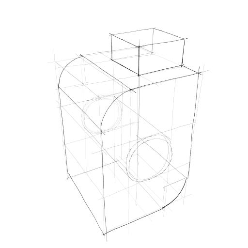

# CAD2Sketch

This is the official repository for the publication [CAD2Sketch: Generating Concept Sketches from CAD Sequences](https://ns.inria.fr/d3/cad2sketch/).

If you should encounter any problems with the code, don't hesitate to contact me
at fhahnlei@cs.washington.edu

# Installation

    git clone https://gitlab.inria.fr/D3/cad2sketch.git
    cd cad2sketch
    conda env create -f environment.yml
    conda activate cad2sketch

## Dependencies

- [SynDraw](https://gitlab.inria.fr/D3/contour-detect)
- [Gurobi](https://www.gurobi.com/)
- [pylowstroke](https://gitlab.inria.fr/D3/pylowstroke)

# Script usage

The program follows the pipeline described in the paper.

Based on an [Onshape](https://www.onshape.com/en/) document, we **download** the 
data of the intermediate steps of the CAD sequence.
Then, we **generate** construction and feature lines.
Next, **line selection** is performed via a discrete optimization problem.
Finally, we **stylize** lines to give them a real-world aesthetic.

## Download
To download information from Onshape, you need to open an account. Once you are logged in, you can [obtain an API Key](https://dev-portal.onshape.com/keys) which let's you communicate with Onshape via the [REST API](https://onshape-public.github.io/docs/apioverview/).
Copy-paste your *access key* and your *secret key* into the corresponding fields in <code>onshape/creds/creds.json</code>.

All the data related to an Onshape document will be stored in a single folder in the <code>data</code> folder. After creating this folder, we can download the document:

    python single_url_processing.py --data_folder=data/tmp_doc --collect_data=true --url=your_onshape_document_url

Note: we automatically copy the entire Onshape workspace into your own documents. It is a good idea to delete this document if not needed anymore to alleviate the servers.

## Line generation
In the file <code>single_url_processing.py</code>, change the variable <code>SYN_DRAW_PATH</code> to where you installed SynDraw.

At this point, we need to choose a viewpoint from where we want to produce a sketch.
The viewpoint is specified using [spherical coordinates](https://en.wikipedia.org/wiki/Spherical_coordinate_system), centered around the bounding box center of the object, so we have to specify a theta and phi angle and a radius.
The radius is a multiplier of the bounding box diagonal, so a radius of <code>1.0</code> places the camera one bounding box diagonal away from the bounding box center.
Empirically, we found that a radius of <code>1.4</code> produces nice results.

Run this command to produce all view-dependent data:

    python single_url_processing.py --data_folder=data/tmp_doc --generate_silhouette_lines=true --recompute_all_construction_lines=true --theta=your_theta_angle --phi=your_phi_angle --radius=your_radius

All view-dependent data will be stored in the subfolder <code>data/tmp_doc/your_theta_your_phi_your_radius</code>.

## Line selection
To perform line-selection, we need to have installed Gurobi.
Our optimization problem takes two lambda parameters as input: <code>your_lambda_1</code> and <code>your_lambda_2</code>. 
Check out the paper for reference values, you can start out with <code>your_lambda_1=0.5</code> and <code>your_lambda_2=0.1</code>.

Run the following command to perform line-selection:

    python single_url_processing.py --data_folder=data/tmp_doc  --theta=your_theta_angle --phi=your_phi_angle --radius=your_radius --declutter_construction_lines=true --lambda_1=your_lambda_1 --lambda_2=your_lambda_2
## Line stylization

Run the following command to perform line stylization:

    python single_url_processing.py --data_folder=data/tmp_doc --theta=your_theta --phi=your_phi --radius=your_radius --npr_rendering=true --designer=your_designer --stylesheet_file=data/stylesheets/your_stylesheet_file

The command takes to additional input arguments.
First, the designer name from the [OpenSketch](https://repo-sam.inria.fr/d3/OpenSketch/index.html) dataset whose stroke geometries and opacities will be used for stylization, e.g. <code>your_designer=Professional6</code>.
Second, the stylesheet file which contains stroke statistics for stylization, e.g. <code>your_stylesheet_file=Professional6_v2.json</code>.

# Quick example
Here is the example code for the following public onshape document:
https://cad.onshape.com/documents/ddc90f60c1fb6c7e5c2dffba/w/95f07f046d85847c01bb4428/e/645a0f04c7cc703069a977c6

    python single_url_processing.py --data_folder=data/example --collect_data=true --url=https://cad.onshape.com/documents/ddc90f60c1fb6c7e5c2dffba/w/95f07f046d85847c01bb4428/e/645a0f04c7cc703069a977c6
    python single_url_processing.py --data_folder=data/example --generate_silhouette_lines=true --recompute_all_construction_lines=true --phi=60
    python single_url_processing.py --data_folder=data/example --phi=60 --declutter_construction_lines=true --lambda_2=0.01
    python single_url_processing.py --data_folder=data/example --phi=60 --npr_rendering=true --stylesheet_file=data/stylesheets/Professional6_v2.json

And the following image will be generated in the folder <code>data/example/60_60.0_1.4/training_data</code>:

# Render ablations

## No construction lines
If you want to render a sketch without construction lines, you can add the flag <code>--only_final_npr_lines=true</code> to the line generation and line selection commands.
The rendering command stays the same:

    python single_url_processing.py --data_folder=data/tmp_doc --generate_silhouette_lines=true --recompute_all_construction_lines=true --theta=your_theta_angle --phi=your_phi_angle --radius=your_radius --only_final_npr_lines=true
    python single_url_processing.py --data_folder=data/tmp_doc  --theta=your_theta_angle --phi=your_phi_angle --radius=your_radius --declutter_construction_lines=true --only_final_npr_lines=true
    python single_url_processing.py --data_folder=data/tmp_doc --theta=your_theta --phi=your_phi --radius=your_radius --npr_rendering=true --designer=your_designer --stylesheet_file=data/stylesheets/your_stylesheet_file --only_final_npr_lines=true

This will pass through the feature lines of the BRep of the last step of the CAD program along with generated silhouette lines.

## No hidden lines
The feature lines include both visible and **hidden** lines, so lines that are hidden by a surface of the object from the current viewpoint.
To exclude also hidden lines, we can use the flag <code>--cut_non_visible_points=true</code>.
This will give us the following commands:

    python single_url_processing.py --data_folder=data/tmp_doc --generate_silhouette_lines=true --recompute_all_construction_lines=true --theta=your_theta_angle --phi=your_phi_angle --radius=your_radius --only_final_npr_lines=true --cut_non_visible_points=true
    python single_url_processing.py --data_folder=data/tmp_doc  --theta=your_theta_angle --phi=your_phi_angle --radius=your_radius --declutter_construction_lines=true --only_final_npr_lines=true --cut_non_visible_points=true
    python single_url_processing.py --data_folder=data/tmp_doc --theta=your_theta --phi=your_phi --radius=your_radius --npr_rendering=true --designer=your_designer --stylesheet_file=data/stylesheets/your_stylesheet_file --only_final_npr_lines=true

## All construction lines
If you want to keep all generated lines, use the flag <code>--keep_all_lines=true</code> in the line selection step:

    python single_url_processing.py --data_folder=data/tmp_doc  --theta=your_theta_angle --phi=your_phi_angle --radius=your_radius --declutter_construction_lines=true --lambda_1=your_lambda_1 --lambda_2=your_lambda_2 --keep_all_lines=true

# Exports

## Export in OpenSketch format

By default, the sketch will also be exported in the OpenSketch format to the following location:
<code>data/your_doc_name/theta_phi_radius/npr_sketch.json</code>.

This format ce be read by using the [pylowstroke](https://gitlab.inria.fr/D3/pylowstroke) library:

    from pylowstroke.sketch_io import SketchSerializer as skio
    sketch = skio.load(file_name)
    sk_io.save(sketch, "sketch.png")

## Export 3D lines as obj file

The following script will export feature lines and feature faces for all steps of the CAD sequence and the selected lines as OBJ files in the object folder.

    python export_3d_data.py --folder=data/tmp_doc --theta=your_theta --phi=your_phi --radius=your_radius

The sketch lines will be stored in the view folder under <code>final_edges.obj</code>.
The script also saves camera information for the scene to be opened in Blender.
The following command will open these OBJ files in a Blender scene with the corresponding camera.

    /Applications/Blender.app/Contents/MacOS/Blender -P blender_result.py -- data/tmp_doc your_theta your_phi your_radius

## Export Stroke attributes

The following script will colored SVG lines in the view_folder with the file name <code>strokes_attribute.svg</code>.

    python export_stroke_attributes.py --folder=data/tmp_doc --theta=your_theta --phi=your_phi --radius=your_radius --feature=your_feature

where <code>your_feature</code> can be either <code>feature_id</code> or <code>line_type</code>.

# Generate training data with Onshape

## Important Note
Because of our workspace copy calls, the following data generation process overloads the Onshape servers and we have been advised not to use this procedure anymore.
For now, we do not advise you to use this script to generate automatically large training datasets. Otherwise, your account might get blocked.

[Here](https://repo-sam.inria.fr/d3/cad2sketch/cad2sketch_dataset.gz) is the dataset generated for the normal map prediction task. Don't hesitate to use it.

## Data generation procedure

For normal map prediction, we generated a dataset of synthetic CAD models with Onshape.
Our shape grammar can be looked up in the [supplementals](https://repo-sam.inria.fr/d3/cad2sketch/supplemental.pdf) and the corresponding script is <code>synthetic_cad_utils.py</code>.

The generation procedure starts by loading the template file <code>onshape/feature_template.json</code> which corresponds to an Onshape document with an empty sketch.
Then, for each CAD sequence generated by our shape grammar, we complement this template with sketch, extrude, fillet or chamfer operations. These operations also have their corresponding template files in the <code>onshape</code> folder, for which we replace parameters.
Since we need to query geometry information between features, we upload each new feature and download intermediate geometry.

Communication with onshape is performed by using their [REST API](https://onshape-public.github.io/docs/). The template files come from feature files obtained using the [GET features](https://onshape-public.github.io/docs/featureaccess/) command. Examining these feature files will allow you to extend the functionalities of CAD2Sketch to new features.
